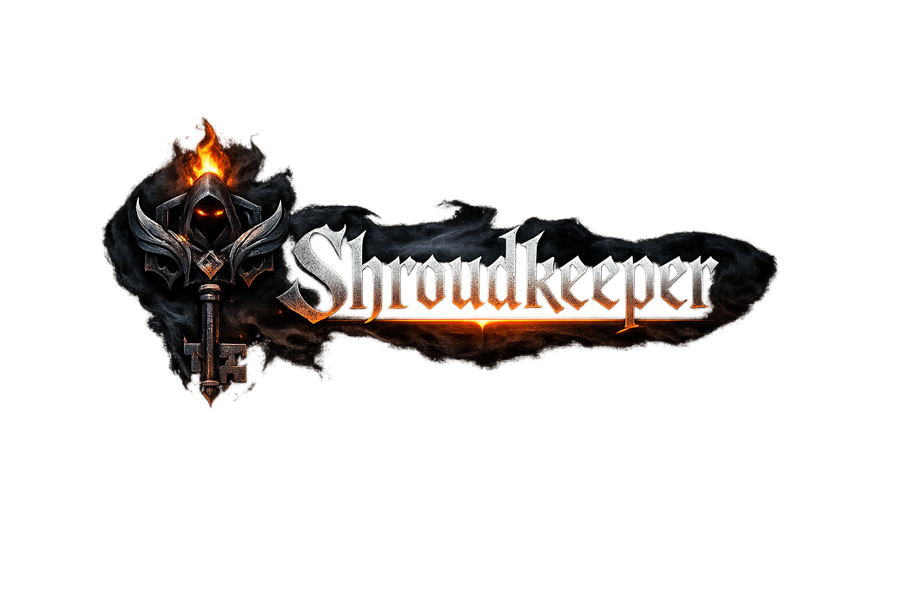

# Shroudkeeper

<p align="center">
	
</p>

Desktop tool for managing, backing up, transferring, and automating Enshrouded savegames.

Current version: **1.1.0**

## Help

- Detailed bilingual help: [docs/HELP.md](docs/HELP.md) or [Wiki](https://github.com/AmFearLiath/Shroudkeeper/wiki)

## Features

- Scan and manage singleplayer slots
- Manage multiplayer profiles (FTP/FTPS/SFTP)
- Transfer savegames between singleplayer and multiplayer
- Create and manage backups
- Restore savegames from backups to singleplayer or multiplayer
- Cron-based automations for server backups/deployments
- Multilingual UI (including DE, EN, RU, FR, IT, ES, PT, PL, BG, CS, TR, ZH, JA, VI)
- Windows distribution as an executable build (PyInstaller)

## Project Structure

```text
shroudkeeper/
	app.py
	assets/
	core/
	i18n/
	storage/
	ui/
```

## Requirements (Development)

- Windows 10/11
- Python 3.11+
- PowerShell

## Installation (Development)

```powershell
cd shroudkeeper
python -m venv .venv
.\.venv\Scripts\Activate.ps1
pip install -r requirements.txt
python app.py
```

## Build (Windows)

Standard OneDir build:

```powershell
cd shroudkeeper
pyinstaller --noconfirm Shroudkeeper.spec
```

Output:

- `shroudkeeper/dist/Shroudkeeper/Shroudkeeper.exe`
- plus required runtime folder (`_internal`)

## Configuration & Data

- User data is stored under `%APPDATA%/Shroudkeeper`.
- No persistent user data is written to the installation directory.

## Security Notes

- Always create a backup before write operations (transfer/rollback/restore).
- Stop the target server before writing multiplayer files.
- Close Enshrouded before local write operations.

## Localization

- Translation files are located in `shroudkeeper/i18n/translations/*.json`.
- New texts are maintained via i18n keys.

## License

This project is licensed under the MIT License. Details, including the third-party list, are provided in `LICENSE`.

## Third-Party

Main libraries used:

- PySide6
- keyring
- aioftp
- asyncssh
- zstandard
- APScheduler
- croniter
- psutil

## Disclaimer

Shroudkeeper is a community project and is not officially affiliated with Keen Games or Enshrouded.

